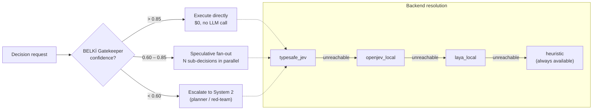

# jev-x-kit

[](https://github.com/Kadihx/jev-x-kit/actions/workflows/ci.yml)
[](LICENSE)
[](tsconfig.json)
[](https://modelcontextprotocol.io)
[](package.json)
[](tests)

Universal **TypeSafe Jev / OpenJev** autonomous decision, deep research, ultra-planning & self-improving agent framework — packaged as a **Claude Code plugin/skill**, an **MCP server**, and a standalone **CLI**.

> Built for Claude Code, Cursor, Codex, **OpenCode**, **Continue.dev**, **Ollama / vLLM**, and every MCP-compatible agent.
> Runs 100% free and offline: no API key, no GPU, no cloud required.

## Install as a Claude Code plugin (30 seconds)

```bash
git clone https://github.com/Kadihx/jev-x-kit.git
cd jev-x-kit && npm install && npm run build
```

Then point Claude Code at this folder as a plugin (`.claude-plugin/plugin.json` is
already wired up: it registers the `jev` skill and the `jev-super-agent` MCP server
with 21 tools). See [`skills/jev/SKILL.md`](skills/jev/SKILL.md) for the command
cheat-sheet Claude reads to decide when to reach for Jev instead of free-text
reasoning.

## Why this exists (6 root problems)

1. **Latency wall** — LLMs take 3–30s for a simple yes/no routing decision.
2. **Token cost explosion** — agent loops burn $10–$50 per session on micro-decisions.
3. **JSON schema breakage** — free-text models hallucinate parameters and break parsers.
4. **Context rot** — "summarized" logs hallucinate file paths, commands and error codes.
5. **Single-pass blind spot** — a model can't adversarially review its own plan.
6. **Vendor lock-in** — paid APIs only, no offline path.

## What this kit does

It inserts a **System 1 decision layer** in front of every micro-decision:

- **Non-autoregressive primitives**: `Choice` (up to 255 options), `Score` (fractional 1–10), `Noul` (calibrated probability in [0, 1]) — never free text, schema-validated, zero output-token cost.
- **"BELKİ" Gatekeeper**: confidence > 0.85 executes directly at $0 LLM cost; 0.60–0.85 splits into speculative sub-decisions; below 0.60 escalates to System 2 or a human.
- **Speculative fan-out**: N independent questions are evaluated in one parallel pass — extra questions add no latency and no cost.
- **Winnow lossless compaction**: irrelevant log lines are *deleted*, never summarized. File paths, commands, error codes, URLs and diff headers are always preserved byte-identically.
- **Adversarial red-teaming**: a hostile reviewer generates concrete anti-theses; the Jev loop arbitrates the safest route with residual risks.
- **RLVR self-improvement**: `tsc` + `npm test` pass/fail records ±1 rewards into `.jev-skill-memory.json`; verified wins auto-tune the gatekeeper thresholds.

## Quickstart (zero config, offline)

```bash
npm install
npm run build
npm test            # 27 unit tests (core 20 + datacenter 7) on the deterministic offline simulator
npm run test:hub    # 7 datacenter tests (source registry, robots, license engine, FTS store, query tiers)
npm run smoke       # full end-to-end MCP smoke test (50 checks)
```

Everything works immediately with **no network, no GPU and no API key** — the deterministic offline simulator keeps every primitive valid and schema-safe.

## MCP server setup

Add this to your agent's MCP config (`mcp-config.json`, `claude_desktop_config.json`, `opencode.json`, Continue.dev, Codex):

```json
{
  "mcpServers": {
    "jev-super-agent": {
      "command": "node",
      "args": ["C:\\path\\to\\jev-x-kit\\dist\\index.js"],
      "env": {
        "JEV_BACKEND_PROVIDER": "auto",
        "OPENJEV_BASE_URL": "http://localhost:8000/v1",
        "JEV_LLM_BASE_URL": "http://localhost:11434/v1"
      }
    }
  }
}
```

### Free local backends (auto-detected in order)

| Backend | Command | Cost |
|---|---|---|
| **OpenJev on vLLM** (`razorback16/openjev`) | `docker run --gpus all -p 8000:8000 razorback16/openjev` | **$0** |
| **LayA** (`NandhaKishorM/laya`) | `python -m laya.serve --port 8000` | **$0** |
| **Ollama** (System-2 LLM for planner/red-team) | `ollama serve` (default `:11434`) | **$0** |
| **Vercel AI Gateway free tier** | set `VERCEL_AI_GATEWAY_KEY` | free tier |
| **TypeSafe Jev native** | `TYPESAFE_JEV_API_KEY` + `TYPESAFE_JEV_NATIVE=1` | $0.042 / 1M in |

Set `JEV_BACKEND_PROVIDER` to `auto` (default), `typesafe_jev`, `openjev_local`, `laya_local` or `heuristic` (fully offline).

## CLI (scriptable, zero MCP client needed)

```bash
node dist/cli.js info                                    # backend + chain diagnosis
node dist/cli.js decide "run tsc first?" --options "yes,no"
node dist/cli.js plan "Ship an offline decision layer" --preset software-architecture
node dist/cli.js redteam "We cache everything forever"
node dist/cli.js compact --file build.log --goal "port binding error"
node dist/cli.js audit .
node dist/cli.js guardrail --tool bash --args "rm -rf /"
node dist/cli.js verify --cwd .                          # RLVR: tsc + tests -> reward
node dist/cli.js label --file data.jsonl --mode score
node dist/cli.js memory report
node dist/cli.js features                                # 20 enterprise features
```

## MCP tools (24)

| Tool | Module | What it does |
|---|---|---|
| `jev_evaluate` | 1 | Fan-out batch of Choice/Score/Noul in one pass |
| `jev_decide` | 1 | "BELKİ" gatekeeper: execute / speculative / system2 |
| `jev_plan` | 2 | Ultra-planning: hypothesis + anti-thesis + 4-dim Jev score |
| `jev_redteam` | 3 | Adversarial dual loop: anti-theses, severity, arbitration |
| `jev_audit` | 4 | 360° scan: architecture / security / marketing / legal / budget |
| `jev_research` | 5a | 4 parallel channels: web / academic / code / social + Jev re-rank |
| `jev_compact` | 5b | Winnow lossless context compaction (delete, never summarize) |
| `jev_github_mine` | 6 | License audit + clean-room originality guard (5-gram Jaccard) |
| `jev_label_dataset` | 7 | Auto-label rows at $0/row into JSONL |
| `jev_preference_pairs` | 7 | RLCD/DPO chosen/rejected pairs for local models |
| `jev_distill_recipe` | 7 | LoRA distillation recipe + axolotl YAML (Qwen2.5-0.5B / ModernBERT-421M) |
| `jev_verify` | 8 | RLVR: run tsc/tests, record reward, auto-tune thresholds |
| `jev_memory` | 8 | Skill memory report / optimize / record / state |
| `jev_dispatch` | 9 | Chief-of-staff role routing from shared memory |
| `jev_guardrail` | 9 | AutoMode pre-execution gate (allow / ask / block) |
| `jev_privacy_sanitize` | 10.7 | Local PII/secret masking before external calls |
| `jev_rerank` | 10.12 | RAG noise filter + top-K re-ranking |
| `jev_edge_qa` | 10.11 | Deterministic edge-case test matrix |
| `jev_pr_gate` | 10.16 | PR gatekeeper: secrets, breaking exports, leftovers |
| `jev_features` | 10 | 20-feature catalog with honest status |
| `jev_backend_info` | infra | Backend chain, pricing, policy, presets, paths |
| `hub_crawl` | research | Politely crawl the 11-source personal-development knowledge base |
| `hub_query` | research | FTS5 + Jev-ranked, cited answers from the crawled hub |
| `hub_stats` | research | Doc counts / word counts per source |

## One-click MCP install

Instead of hand-editing `claude_desktop_config.json` / `.cursor/mcp.json` /
`.continue/config.json`, run:

```bash
npm run install-mcp
```

`scripts/install-mcp.js` detects Claude Desktop, Cursor and Continue.dev on
your machine, merges (never overwrites) a `jev-super-agent` entry into
whichever config files exist, and backs up each original file to `<file>.bak`
first.

## How it works



Every primitive call (`Choice` / `Score` / `Noul`) is schema-validated —
never free text — and the backend chain always terminates in a deterministic
offline simulator, so nothing ever fails closed even with no network, no GPU
and no API key.

## Multi-domain presets (7)

`software-architecture`, `marketing-growth`, `product-ux`, `cost-model-router`, `cybersecurity`, `legal-compliance` (KVKK/GDPR), `finance-valuation` — every preset injects rules, red-flags, checklists and a scoring rubric into Jev `state` verbatim.

## Self-improving memory

`.jev-skill-memory.json` stores decisions, verified outcomes and calibration buckets. The dynamic threshold auto-tuner lowers the `executeThreshold` when calibrated buckets over-deliver and raises it when they fail — so the system provably gets cheaper and safer with every verified outcome.

## Configuration (all optional, all env-driven)

| Env var | Default | Purpose |
|---|---|---|
| `JEV_BACKEND_PROVIDER` | `auto` | `auto` / `typesafe_jev` / `openjev_local` / `laya_local` / `heuristic` |
| `OPENJEV_BASE_URL` | `http://localhost:8000/v1` | local OpenJev / vLLM endpoint |
| `TYPESAFE_JEV_API_KEY` | — | hosted Jev key (or `VERCEL_AI_GATEWAY_KEY`) |
| `JEV_LLM_BASE_URL` | `http://localhost:11434/v1` | System-2 LLM (Ollama, vLLM, LM Studio) |
| `JEV_LLM_MODEL` | `qwen2.5:7b-instruct` | System-2 model |
| `JEV_GATE_EXECUTE` | `0.85` | gatekeeper direct-execution threshold |
| `JEV_GATE_ESCALATE` | `0.6` | "BELKİ" escalation threshold |
| `JEV_MEMORY_PATH` | `<repo>/.jev-skill-memory.json` | persistent self-improving memory |

## Development

```bash
npm run build      # strict TS compile (zero warnings)
npm test           # 27 unit tests (core 20 + datacenter 7)
npm run smoke      # 50-check end-to-end MCP client test
npm run test:real  # REAL model test: needs `ollama serve` + a local model (e.g. qwen2.5:3b)
npm run test:hub   # 7 datacenter-only tests, no network
```

## Benchmark: how much does this actually save?

Real, reproducible numbers (not marketing copy) comparing `jev_research` to a
Claude Code session doing the same research task by hand
(`WebSearch`/`WebFetch` + inline reasoning, no local decision layer):

| | jev_research | vanilla Claude Code |
|---|---|---|
| Tokens entering Claude's context | ~2,300 avg | ~43,000 avg (**~19x more**) |
| Tool round-trips | 1 | 10-12 (**~11x more**) |
| Wall-clock | 3-10s (measured) | ~30-36s (assumption-labeled estimate) |

Full methodology, caveats, and how to reproduce every number yourself:
[`BENCHMARK.md`](BENCHMARK.md).

## Research Hub (knowledge data center)

Nightly-scraped research library for personal development, rationality,
cognitive psychology and philosophy — 11 curated sources in 3 tiers
(mental-models / library / academic), SQLite + FTS5 store, Jev-ranked answers.

```bash
npm run hub -- sources                        # list the 11 sources + policies
npm run hub -- crawl --dry-run                 # robots.txt + discovery preview, zero writes
npm run hub -- crawl --source sivers --force   # crawl one source now (off-hours override)
npm run hub -- crawl                           # full nightly crawl (02:00–06:00 Europe/Berlin)
npm run hub -- query "second-order thinking"   # FTS5 + Jev Noul re-rank + VERIFIED/PROBABLE/REJECTED tiers
npm run hub -- stats                           # docs + word counts per source
```

Pipeline per document: hour-window gate → robots.txt gate → sitemap/HTML/JSON
discovery → license check (public-domain full text · academic/library
metadata-only) → polite fetch → `data/research-hub.sqlite` (+ FTS5 index).

## License

MIT.

